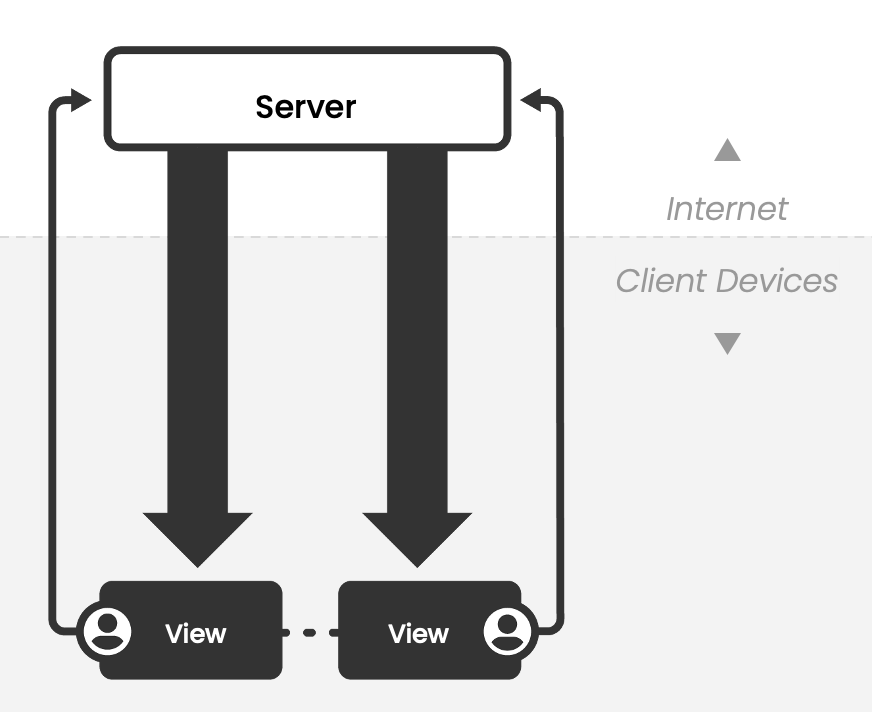
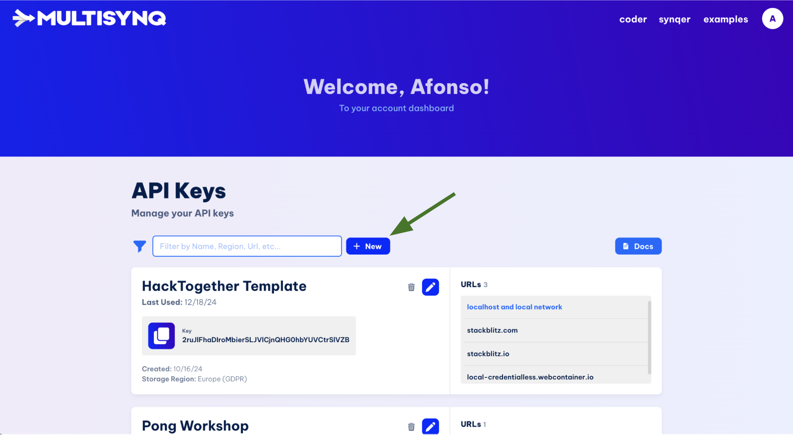
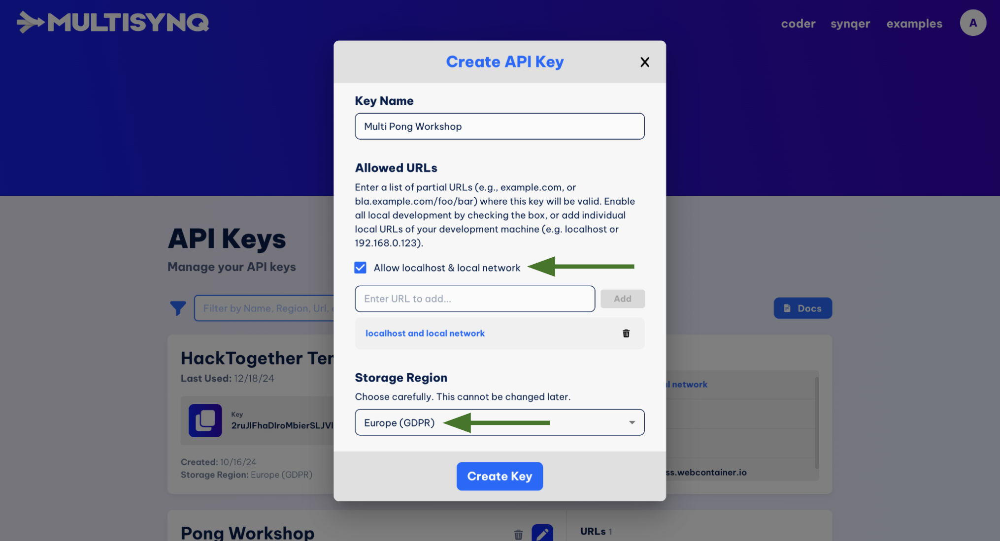
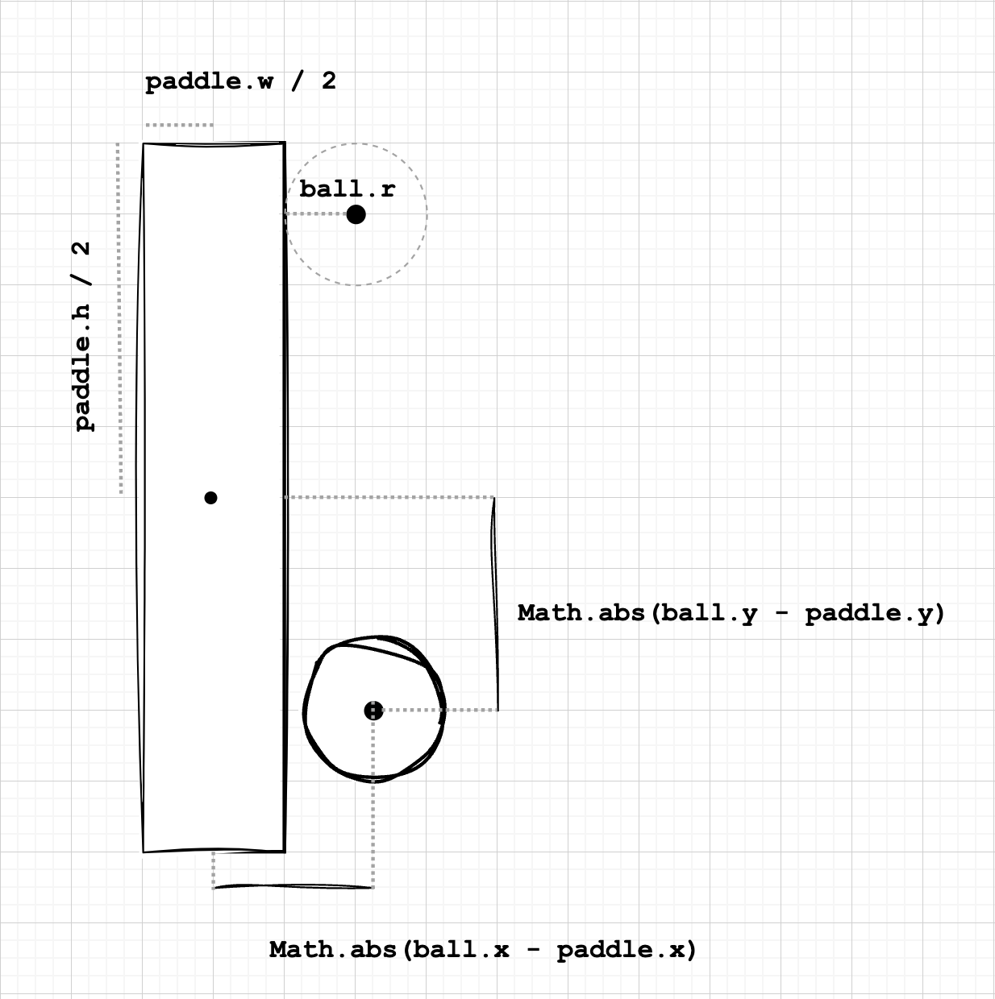

# Building a Multiplayer Pong Game using Croquet

## Introduction
This tutorial will guide you through building a real-time multiplayer Pong game using [Croquet](https://multisynq.io/docs/croquet/), a powerful framework for creating synchronized multiplayer experiences without writing backend code.

- **Time**: ~40 minutes
- **Difficulty**: Intermediate
- **Prerequisites**:
  - Basic JavaScript knowledge
  - A code editor
  - A modern web browser


## Overview

This tutorial is divided into 4 steps:

1. **Creating a Single Player Bouncing Ball** (10 min)
2. **Synchronizing the Ball** (10 min)
3. **Adding Player Paddles** (10 min)
4. **Implementing scoring system** (10 min)

<!-- [View Final Demo](link_to_demo) | [Final Source Code](link_to_code) -->
[Final Source Code](TODO)


## Step 1: Single Player Bouncing Ball

Let's start by creating a new HTML file:

```html
<html>
    <head>
      <meta charset="utf-8">
      <meta name="viewport" content="width=device-width,initial-scale=1,maximum-scale=1,user-scalable=no">
      <title>MultiPong</title>

      <!-- Import the Croquet library -->
      <script src="https://unpkg.com/@croquet/croquet@2.0.0-42"></script>

      <!-- Define some styles for the canvas -->
      <style>
html, body {
  margin: 0;
  height: 100%;
  background: #999;
}
#canvas {
  object-fit: contain;
  max-width: 100%;
  max-height: 100%;
  background: #000;
}
      </style>
    </head>
    <body>

      <!-- Create a canvas element -->
      <canvas id="canvas" width="1000" height="1000"></canvas>
    </body>

    <script>
      // Your logic should be added here:

    </script>
</html>
```

This will be our starting point for the game.
This file imports the Croquet library, creates a canvas element in the page, and applies some basic styles.

All the logic we will add in this tutorial should be added inside the `<script>` tags, in the end of the file.

If you open this file in your browser, you should see a black square in your screen.

[[Checkpoint](./checkpoints/00_starting_point.html)]

### Step 1.1: Draw a static ball in the canvas


Now let's add a Ball and render it.
We will use classes to store the game data and to implement the game logic.

Let's define a simple Ball class that stores an `x` and `y` positions and a radius `r`, and then let's draw the ball in the canvas.


```js
const CANVAS_WIDTH = 1000;
const CANVAS_HEIGHT = 1000;

class Ball {
  constructor({
    x = CANVAS_WIDTH / 2,
    y = CANVAS_HEIGHT / 2,
    r = 10
  } = {}) {
    this.x = x;
    this.y = y;
    this.r = r;
  }
}

ctx = canvas.getContext("2d");

const ball = new Ball()

function drawBall(ball) {
  if (!ball) return;

  ctx.beginPath();
  ctx.arc(ball.x, ball.y, ball.r, 0, Math.PI * 2);
  ctx.fillStyle = "white";
  ctx.fill();
  ctx.stroke();
}

drawBall(ball);
```

[[Checkpoint](./checkpoints/01_static_ball.html)]

### Step 1.2: Make the ball move around the screen

To make the ball move around the screen, we need to:

1. Store velocity information in the Ball class
2. Create a `Ball.update` method that will update the ball position
3. Make sure the canvas is redrawn every time the ball moves

```js
// ...
const UPDATE_INTERVAL = 50;

class Ball {
  constructor({
    x = CANVAS_WIDTH / 2,
    y = CANVAS_HEIGHT / 2,
    r = 10,
    dx = 6,
    dy = 8
  } = {}) {
    // ...
    this.dx = dx;
    this.dy = dy;

    // We want to start the update loop
    // as soon as the ball is created
    this.update();
  }

  update() {
    this.x += this.dx;
    this.y += this.dy;

    setTimeout(() => this.update(), UPDATE_INTERVAL);
  }
}

// ...

// Replace this line with the code below
// drawBall(ball);

function renderLoop() {
  // Clear the canvas
  ctx.clearRect(0, 0, CANVAS_WIDTH, CANVAS_HEIGHT);
  ctx.lineWidth = 3;
  ctx.strokeStyle = "white";

  // Draw our contents
  drawBall(ball);

  requestAnimationFrame(renderLoop);
}

renderLoop();
```
We define a constant `UPDATE_INTERVAL` to define the interval between consecutive ball position updates.
We want the update function to be executed every `UPDATE_INTERVAL` milliseconds, so we use [`setTimeout`](https://developer.mozilla.org/en-US/docs/Web/API/Window/setTimeout) to schedule the next update.

The [requestAnimationFrame](https://developer.mozilla.org/en-US/docs/Web/API/Window/requestAnimationFrame) function requests the browser to call the `renderLoop` function before the next repaint.

[[Checkpoint](./checkpoints/02_moving_ball.html)]

### Step 1.3: Make the ball bounce off the walls

Now let's add bouncing logic to the `Ball.update()` method:
We want to reverse the direction of the ball when it collides with the walls.
It's important to make sure we only reverse the velocity direction if we are actually moving towards the wall, otherwise the ball could get "stuck" bouncing back and forth!

```js

class Ball {
  // ...
  update() {
    this.x += this.dx;
    this.y += this.dy;

    // Making sure we only reverse the direction if
    // we are actually moving towards the wall.
    // This avoids the ball getting "stuck" bouncing back and forth
    if (
      this.dx > 0 ?
      (this.x > CANVAS_WIDTH - this.r) :  
      (this.x < this.r)
    ) {
      this.dx = -this.dx;
    }

    if (
      this.dy > 0 ?
      (this.y > CANVAS_HEIGHT - this.r) :
      (this.y < this.r)
    ) {
      this.dy = -this.dy;
    }

    // Schedule the next update
    setTimeout(() => this.update(), UPDATE_INTERVAL);
  }
}

```

[[Checkpoint](./checkpoints/03_bouncing_ball.html)]

---

Now that we have a bouncing ball, it's time to synchronize it across multiple clients.

But before we continue, let's take a look at how Croquet synchronization works.

## How Croquet works:

Croquet allows you to synchronize multiple frontends without writing any backend or networking code.

> Croquet synchronization works by having all clients execute the **exact same simulation** at the same time.

In a traditional multiplayer application, synchronization is done as follows:
 - The clients send their inputs to the server;
 - The server validates the client inputs;
 - The server updates the state accordingly;
 - The server sends the updated state (or changes) to all clients.



In Croquet, the logic lives in the frontend and is executed by all the clients.
Croquet uses generic synchronization servers that ensure all clients process the same event sequence simultaneously.
Since event handling is deterministic, it's guaranteed that all clients will end up with the same state.

The Croquet synchronization flow is the following:
 - A frontend sends an event to the synchronization server;
 - The server broadcasts the event to all frontends;
 - All frontends validate the event;
 - All frontends update their state accordingly.


### Main Concepts [[1](https://multisynq.io/docs/croquet/)]

Every Croquet application consists of two parts:

 - The **views** (gray squares in the GIF above) handle user input and output. They process all keyboard / mouse / touch events, and determine what is displayed on the screen.

 - The **models** (orange squares in the GIF above) handle all calculation and simulation. This is where the actual work of the application takes place. The models are saved, shared, and loaded automatically.

Models are guaranteed to always be identical for all users. However, the views are not. Different users might be running on different hardware platforms, or might display different representations of the models.

When you launch a Croquet application, you automatically join a shared session. As long as you're in the session, your models will be identical to the models of every other user in the session.

The views interact with the models through `events`. When you publish an event from a view, it's mirrored to everyone else in your session, so everyone's models receive exactly the same event stream.


## Getting a Multisynq API key

To access Multisynq's synchronization services, we need to get a Multisynq API key.
(Multisynq is the company, Croquet is the technology).

To get an API key, go to https://multisynq.io/account and click on the `+ New` button.


 

A dialog will open, and we need to fill in the following fields:

 - **Name**: You can give any name to the API key - it helps you identify which keys are being used for which project.
 - **Allow localhost & local network**: Since we'll be running this project on localhost, we need to check the "Allow localhost & local network" option.
 - **Region**: Make sure to select the "Europe (GDPR)" region.



When you're done, click on "Create key".


## Step 2: Synchronized bouncing ball

Now we're ready to start synchronizing the application.
To do so, we will need to:

1. Make the `Ball` class a Croquet Model
2. Create a Croquet View
3. Add logic to join a Croquet session

### 2.1. Make the `Ball` class extend `Croquet.Model`

```js
class Ball extends Croquet.Model {
  // ...
}
```
The [`Croquet.Model`](https://multisynq.io/docs/croquet/Model.html) class is the base class for all the synchronized models in the application. 

### 2.2. Change the `Ball` `constructor` to be an `init` method

```js
class Ball extends Croquet.Model {
  // Rename `constructor` to `init`
  init({ /* ... */ }) {
    super.init();

    // ...
  }
}
```

Models are only initialized by calling [`Model.init()`](https://multisynq.io/docs/croquet/Model.html#do-not-create-a-%7B%40link-model%7D-instance-using-new-anddo-not-override-the-constructor!) **the first time the object comes into existence** in the session. After that, when joining a session, the models are restored without calling `init()`.

If we had a constructor, it would be called all the time, not just when starting a session.

We also need to initialize the super class, so we must not forget to call `super.init()` in the `init()` method of our models.

### 2.3. Change `setTimeout` to the `this.future` method 

```js
class Ball extends Croquet.Model {
  // ...

  update() {
    // ...

    // REMOVE THIS LINE!!
    // setTimeout(() => this.update(), UPDATE_INTERVAL);

    // Add this instead
    this.future(UPDATE_INTERVAL).update();
  }
}
```

The [`Model.future`](https://multisynq.io/docs/croquet/Model.html#future) method schedules a function to be executed in the future. It will be executed simultaneously for all frontends.


### 2.4. Register the `Ball` class 

```js
class Ball extends Croquet.Model {
  // ...
}
Ball.register("Ball");
```

It is necessary to [register](https://multisynq.io/docs/croquet/Model.html#.register) all Model classes so Croquet can know which class to use when creating existing model objects.

We need to explicitly pass a `classId` as a string to ensure Croquet can recreate each object instance even when the source code is minified (which may change the actual class name).


---

### 2.5. Create a Croquet View Class

All the rendering logic we built previously will now be moved to the `Display` class.
The initialization should be done in the constructor (as oppposed to Croquet Models, the View should be initialized in the constructor, since the view is local to each client!)

> Since `ctx` is now stored inside the `Display` class, we need to access it through the `this.ctx` property.

```js
class Display extends Croquet.View {
  constructor(model) {
    super(model);
    this.model = model;
    this.ctx = canvas.getContext("2d");
  }

  // This is the `drawBall` function we built previously
  // Keep in mind we need to access the `ctx` property through `this.ctx`
  drawBall(ball) {
    if (!ball) return;

    this.ctx.beginPath();
    this.ctx.arc(ball.x, ball.y, ball.r, 0, Math.PI * 2);
    this.ctx.fillStyle = "white";
    this.ctx.fill();
    this.ctx.stroke();
  }
  
  // This is the `renderLoop` function. We need to rename it to `update`
  // to override the Croquet.View.update() method
  update() {
    // Clear the canvas
    this.ctx.clearRect(0, 0, 1000, 1000);
    this.ctx.lineWidth = 3;
    this.ctx.strokeStyle = "white";

    // Now the `ball` object is stored in the `this.model` property
    this.drawBall(this.model);

  }
}
```
We don't need to call `requestAnimationFrame` anymore since the [`View.update`](https://multisynq.io/docs/croquet/View.html#update) method is already called once per frame.

---

### 2.6. Join a Croquet session

```js
Croquet.Session.join({
  apiKey: "Your API key",
  appId: "io.multisynq.pong.yourName",
  name: Croquet.App.autoSession(),
  password: Croquet.App.autoPassword(),
  model: Ball,
  view: Display,
});
```

This will make your page join a Croquet session as soon as it loads.
The `model` and `view` parameters specify the classes that should be used as the session root model and view, respectively.


([Session.join](https://multisynq.io/docs/croquet/Session.html#.join) docs)

---

After we complete these steps, we should be able to view a synchronized ball bouncing around the screens!

[[Checkpoint](./checkpoints/04_synchronized_ball.html)]


## Step 3: Adding player paddles

The next step is to add user-controlled paddles to the game.
But before we do that, let's reorganize our code to make it easier to add new classes.


### Step 3.1: Organize the code

Let's start by creating a `Pong` class that will manage the whole game state and contain other game objects such as player paddles.

Similarly as before, that class should extend `Croquet.Model`, have an `init` method and call `super.init()`.
We should also register it as well!!

```js
class Pong extends Croquet.Model {
  init() {
    super.init();
  }
}
Pong.register("Pong");
```

Next we need to instantiate and store a Ball instance in the Pong model.

> Croquet models should be instantiated using the [`Model.create`](https://multisynq.io/docs/croquet/Model.html#.create) method!! ([learn why](https://multisynq.io/docs/croquet/Model.html#do-not-create-a-%7B%40link-model%7D-instance-using-new-anddo-not-override-the-constructor!)).


```js
// ...
const BALL_SPEED = 15;

class Pong extends Croquet.Model {
  init() {
    super.init();

    // Here we will initialize the ball
    const speedAngle = Math.random() * Math.PI * 2;
    this.ball = Ball.create({
      x: CANVAS_WIDTH / 2,
      y: CANVAS_HEIGHT / 2,
      dx: BALL_SPEED * Math.cos(speedAngle),
      dy: BALL_SPEED * Math.sin(speedAngle),
    });
  }
}
Pong.register("Pong");
```

Now let's move the main loop logic to the `Pong` class, and remove the `future` calls from the `Ball.update()` method.

```js
class Ball extends Croquet.Model {
  // ...
  init() {
    // ...

    // Remove this line
    // this.update();
  }

  update() {
    // ...

    // REMOVE THIS LINE!!
    // this.future(UPDATE_INTERVAL).update();
  }
}
Ball.register("Ball");

class Pong extends Croquet.Model {
  init() {
    // ...

    this.mainLoop();
  }

  mainLoop() {
    this.ball?.update();
    this.future(UPDATE_INTERVAL).mainLoop();
  }
}
Pong.register("Pong");
```

Let's also update the `Display` class to use the `Pong` model.

```js
class Display extends Croquet.View {
  // ...

    update() {
      // ...

      // Now the `ball` object is stored in `this.model.ball`
      this.drawBall(this.model.ball);
    }
}
```

Finally, we need to pass the `Pong` model to the `Croquet.Session.join()` call.

```js
Croquet.Session.join({
  // ...
  model: Pong,
});
```

By now, we should see the same as we did in the previous step, but now the code is more organized and easier to extend.

[[Checkpoint](./checkpoints/05_pong_model.html)]

### Step 3.2: Creating player paddles

Let's create a `Paddle` class that will contain the logic of the player paddle.
Each paddle will store its `x` and `y` position and the vertical speed `dy`.
We'll also store the `viewId` that's associated to each paddle, and their width and height properties.

```js
class Paddle extends Croquet.Model {
  init({ x, y, viewId }) {
    super.init();

    this.viewId = viewId;

    this.x = x;
    this.y = y;

    this.dy = 0;

    this.w = 20;
    this.h = 100;
  }
}
Paddle.register("Paddle");
```

Now that the `Paddle` class is defined, we can instantiate one paddle for each of the two players that join the current session.

Croquet publishes a [`view-join`](https://multisynq.io/docs/croquet/global.html#event:view-join) event whenever a new _view_ joins the session.
We can [subscribe](https://multisynq.io/docs/croquet/Model.html#subscribe) to this event to execute custom logic when that happens.

Croquet events are published to a scope and also have a name. These values can be arbitrary strings, and are used to easily manage which events we want to subscribe to.

The `view-join` event is published to the `sessionId` scope and has the name `view-join`.

Let's update the `Pong` class to create a new paddle for the first two views that join the session.

```js
class Pong extends Croquet.Model {
  init() {
    // ...

    this.leftPaddle = null;
    this.rightPaddle = null;

    // Subscribe to the view-join event
    this.subscribe(this.sessionId, "view-join", this.viewJoined);
  }

  // ...

  viewJoined(viewId) {
    // If we already have two paddles, do nothing
    if (this.leftPaddle !== null && this.rightPaddle !== null) {
      console.log("Game is full!");
      return;
    }

    // Otherwise, create first the left, then the right paddle
    const isLeft = this.leftPaddle === null;
    const x = isLeft ? 100 : CANVAS_WIDTH - 100;
    const y = CANVAS_HEIGHT / 2;
    const paddle = Paddle.create({
      x,
      y,
      viewId,
    });

    if (isLeft) {
      this.leftPaddle = paddle;
    } else {
      this.rightPaddle = paddle;
    }
  }
}
Pong.register("Pong");
```

Now let's update our `Display` class to render the paddles on the canvas:

```js
class Display extends Croquet.View {
  // ...

  drawPaddle(paddle) {
    if(!paddle) return;

    const { x, y, w, h } = paddle;
    this.ctx.fillStyle = "white";
    this.ctx.fillRect(x - w / 2, y - h / 2, w, h);
  }
  
  update() {
    // ...

    this.drawPaddle(this.model.leftPaddle);
    this.drawPaddle(this.model.rightPaddle);
  }
}
```

We're almost there!! Let's also add logic to remove the paddles when their respective view disconnects from the session.
Similarly to the [`view-join`](https://multisynq.io/docs/croquet/global.html#event:view-join) event, we can subscribe to the [`view-exit`](https://multisynq.io/docs/croquet/global.html#event:view-exit) event.


```js
class Pong extends Croquet.Model {
  init() {
    // ...

    this.subscribe(this.sessionId, "view-exit", this.viewExited);
  }

  // ...

  viewExited(viewId) {
    if (this.leftPaddle?.viewId === viewId) {
      this.leftPaddle.destroy();
      this.leftPaddle = null;
    } else if (this.rightPaddle?.viewId === viewId) {
      this.rightPaddle.destroy();
      this.rightPaddle = null;
    }
  }
  // ...
}
Pong.register("Pong");
```
> When deleting model objects, it's important to always call the [`Model.destroy()`](https://multisynq.io/docs/croquet/Model.html#destroy) method. 
> It removes all subscriptions that model has, unschedules all future messages, and removes it from future snapshots.

[[Checkpoint](./checkpoints/06_static_paddles.html)]

### Step 3.3: Adding paddle movement logic

It's time to add the paddle movement logic.
To achieve that goal, we need to configure our `Display` class to publish events that indicate if the paddle is moving up or down.

Since we want each player's inputs to affect only their own paddle, we can use the `viewId` value to scope the events to each player:

Let's start by subscribing to the events that will control the player paddles:

```js
// ...
const PADDLE_SPEED = 10;

class Paddle extends Croquet.Model {
  init({ x, y, viewId }) {
    // ...
    this.subscribe(viewId, "up-key", this.upKey);
    this.subscribe(viewId, "down-key", this.downKey);
  }

  upKey(isPressed) {
    // If the key is pressed, we start moving the paddle up
    if (isPressed) {
      this.dy = -PADDLE_SPEED;
    // Otherwise, we just stop moving if we were moving upwards
    } else if (this.dy < 0) {
      this.dy = 0;
    }
  }

  downKey(isPressed) {
    // If the key is pressed, we start moving the paddle down
    if (isPressed) {
      this.dy = PADDLE_SPEED;
    // Otherwise, we just stop moving if we were moving downwards
    } else if (this.dy > 0) {
      this.dy = 0;
    }
  }
}
Paddle.register("Paddle");
```

Let's also change the `Paddle` and `Pong` classes to update the paddle position according to its velocity:

```js
class Paddle extends Croquet.Model {
  // ...

  update() {
    let newY = this.y + this.dy;

    // Make sure the paddle does not move out of the canvas
    if (newY < this.h / 2) {
      newY = this.h / 2;
    } else if (newY > CANVAS_HEIGHT - this.h / 2) {
      newY = CANVAS_HEIGHT - this.h / 2;
    }
    this.y = newY;
  }
}
Paddle.register("Paddle");

class Pong extends Croquet.Model {
  // ...
  mainLoop() {
    this.ball?.update();
    this.leftPaddle?.update();
    this.rightPaddle?.update();
    this.future(UPDATE_INTERVAL).mainLoop();
  }
}
Pong.register("Pong");
```

Finally, we need to update our `Display` class to publish events when the user presses the up or down keys:

```js
class Display extends Croquet.View {
  constructor(model) {
    // ...

    document.onkeydown = (e) => {
      if (e.repeat) return;
      switch (e.key) {
        case "ArrowUp":
          // `true` indicactes that the key is pressed
          this.publish(this.viewId, "up-key", true);
          break;
        case "ArrowDown":
          // `true` indicactes that the key is pressed
          this.publish(this.viewId, "down-key", true);
          break;
      }
    };

    document.onkeyup = (e) => {
      if (e.repeat) return;
      switch (e.key) {
        case "ArrowUp":
          // `false` indicates that the key is released
          this.publish(this.viewId, "up-key", false);
          break;
        case "ArrowDown":
          // `false` indicates that the key is released
          this.publish(this.viewId, "down-key", false);
          break;
      }
    };
  }
  // ...
}
```

---

**Note:** One subtlety of programming Croquet applications is that we need to think about events in terms of **"what the user intends to do"**, instead of "what's the outcome of the action".

If the event data already contains the outcome of its respective action (e.g. the new position of the paddle), we may incur in [race conditions](https://en.wikipedia.org/wiki/Race_condition) that could break our application logic.

Instead, our events should describe the user's intended action, and then let the model instances of all the connected clients compute the result of that action, in the respective handler.

---

[[Checkpoint](./checkpoints/07_moving_paddles.html)]

### Step 3.4: Colliding ball with paddles

Now we need to check if the ball is colliding with the paddles, and if so, bounce it off.


Let's add a method to the `Ball` class to check for collisions with a paddle:




```js
class Ball extends Croquet.Model {
  // ...

  checkCollision(paddle) {
    if (!paddle) return;

    if (Math.abs(this.y - paddle.y) <= paddle.h / 2 + this.r) {
      // Check horizontal collision
      if (
        // Only collide if the ball is moving towards the paddle
        this.dx < 0
          ? this.x > paddle.x && this.x - paddle.x <= paddle.w / 2 + this.r
          : this.x < paddle.x && paddle.x - this.x <= paddle.w / 2 + this.r
      ) {
        this.dx = -this.dx;
      }
    }
  }
}
Ball.register("Ball");
```

And now we need to call the `checkCollision` method from the `Pong.mainLoop()` method:

```js
class Pong extends Croquet.Model {
  // ...
  mainLoop() {
    this.ball?.update();
    this.leftPaddle?.update();
    this.rightPaddle?.update();

    // Insert the collision check here
    this.ball?.checkCollision(this.leftPaddle);
    this.ball?.checkCollision(this.rightPaddle);

    this.future(UPDATE_INTERVAL).mainLoop();
  }
}
Pong.register("Pong");
```

[[Checkpoint](./checkpoints/08_paddle_collisions.html)]

## Step 4: Game scores

Now we need to add scoring logic to the game.

### Step 4.1: Displaying player scores

To do so, let's add a `leftScore` and `rightScore` properties to the `Pong` model, and increment them when the ball reaches the left or right

```js
class Pong extends Croquet.Model {
  init() {
    // ...

    this.leftScore = 0;
    this.rightScore = 0;
  }

  checkScore() {
    if (!this.ball) return;

    if (this.ball.x <= 0 + this.ball.r) {
      this.rightScore++;
    } else if (this.ball.x >= CANVAS_WIDTH - this.ball.r) {
      this.leftScore++;
    }
  }

  mainLoop() {
    // ...

    this.checkScore();

    this.future(UPDATE_INTERVAL).mainLoop();
  }
}
Pong.register("Pong");
```

Now we need to update the `Display` class to display the score on the screen.

```js
class Display extends Croquet.View {
  // ...

  drawScore(score, isLeft) {
    const x = isLeft ? CANVAS_WIDTH / 4 : CANVAS_WIDTH * 3 / 4;
    const y = 50;
    this.ctx.font = "48px Arial";
    this.ctx.fillStyle = "white";
    this.ctx.textAlign = "center";
    this.ctx.fillText(score, x, y);
  }
  
  update() {
    // ...
    this.drawScore(this.model.leftScore, true);
    this.drawScore(this.model.rightScore, false);
  }
}
```

[[Checkpoint](./checkpoints/09_game_scores.html)]

### Step 4.2: Resetting the ball when a player scores

We also want to remove the ball when a player scores, and to create a new one in the center of the screen:

Let's start by refactoring the logic of creating a new ball to a separate function:

```js
class Pong extends Croquet.Model {
  init() {
    // ...

    // REMOVE THESE LINES
    // const speedAngle = Math.random() * Math.PI * 2;
    // this.ball = Ball.create({
    //   x: CANVAS_WIDTH / 2,
    //   y: CANVAS_HEIGHT / 2,
    //   dx: BALL_SPEED * Math.cos(speedAngle),
    //   dy: BALL_SPEED * Math.sin(speedAngle),
    // });

    this.newBall();

    // ...
  }

  newBall() {
    // Make sure we have at most one ball
    if (this.ball) {
      this.ball.destroy();
    }

    const speedAngle = Math.random() * Math.PI * 2;
    this.ball = Ball.create({
      x: CANVAS_WIDTH / 2,
      y: CANVAS_HEIGHT / 2,
      dx: BALL_SPEED * Math.cos(speedAngle),
      dy: BALL_SPEED * Math.sin(speedAngle),
    });
  }
}
```

Now everytime someone scores, we can call the `newBall` method.

```js
class Pong extends Croquet.Model {
  // ...
  checkScore() {
    if (!this.ball) return;

    if (this.ball.x <= 0 + this.ball.r) {
      this.rightScore++;
      this.newBall();
    } else if (this.ball.x >= CANVAS_WIDTH - this.ball.r) {
      this.leftScore++;
      this.newBall();
    }
  }
  // ...
}
```

[[Checkpoint](./checkpoints/10_tutorial_final_code.html)]

And that's it! We've just built a simple multiplayer game using Croquet.
While simple, we've covered most of the essential concepts needed to build more complex games.
The rest of this document will cover small improvements to the game, but the core tutorial is now complete!

---

## Next steps

In this tutorial we've built a very simple version of Pong, and there are many ways to improve it.

Here are some ideas:

 - When a player scores, make the ball move towards the other player
 - The game score resets when a player reaches a certain score
 - Make the ball bounce angle change based on where it hits the paddle
 - Add a delay between a score and the ball appearing in the center of the screen
 - Have two balls and two players in each team, but the player paddles cannot overlap
 - ...

Feel free to create a [Pull Request](https://github.com/afonsocrg/multi-pong/pulls) with your improvements!
It will be awesome to see what everyone comes up with!